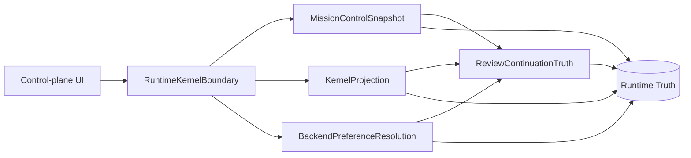
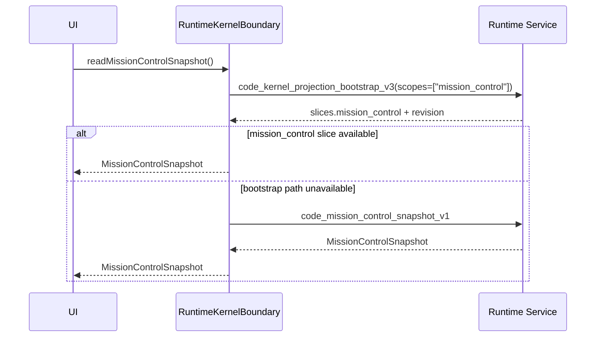
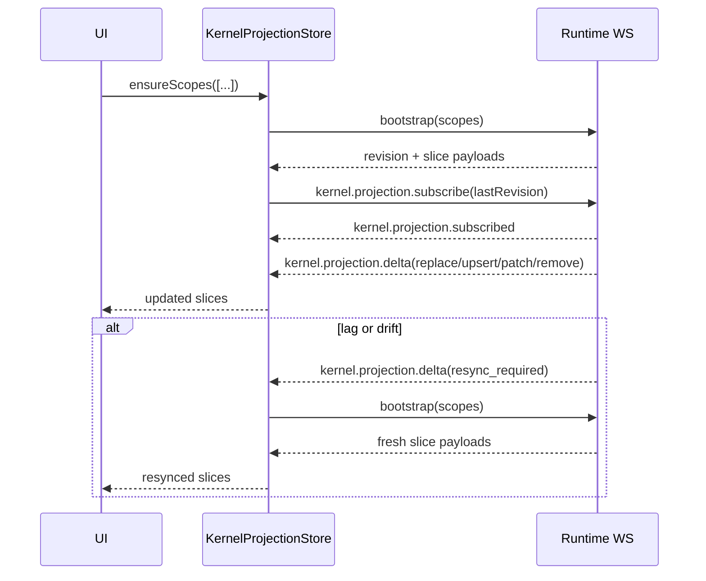
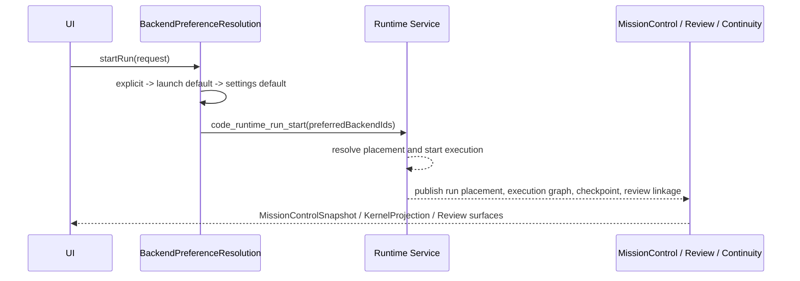

# Runtime Borrowing Blueprint

Date: 2026-03-22
Status: active
Local implementation baseline: `fastcode` @ `7200f5feb7ebed1bda6fe9f5ec911440db45acd2`

## Purpose

This document turns the current HugeCode runtime architecture into a migration-first borrowing
blueprint. It is not a generic product analysis and it is not a repo tour. The target outcome is a
decision pack that says:

- which runtime patterns are worth copying directly
- which ones should be adapted instead of cloned
- which ones should be deferred entirely
- what the first useful adoption slice should contain

This blueprint treats local tracked source as the implementation truth and uses current public
material only as calibration.

## Authority And Calibration

Implementation truth in this repo:

- [`apps/code/src/application/runtime/kernel/createRuntimeKernel.ts`](../../apps/code/src/application/runtime/kernel/createRuntimeKernel.ts)
- [`packages/code-runtime-host-contract/src/codeRuntimeRpc.ts`](../../packages/code-runtime-host-contract/src/codeRuntimeRpc.ts)
- [`packages/code-runtime-service-rs/src/rpc_dispatch_kernel.rs`](../../packages/code-runtime-service-rs/src/rpc_dispatch_kernel.rs)
- [`packages/code-runtime-service-rs/src/rpc_dispatch_mission_control.rs`](../../packages/code-runtime-service-rs/src/rpc_dispatch_mission_control.rs)
- [`packages/code-workspace-client/src/workspace-shell/kernelProjectionStore.ts`](../../packages/code-workspace-client/src/workspace-shell/kernelProjectionStore.ts)

External calibration sources:

- HugeCode public `fastcode` branch description:
  <https://github.com/byoungd/keep-up/tree/fastcode>
- GitHub Copilot coding agent:
  <https://docs.github.com/en/copilot/concepts/agents/coding-agent/about-coding-agent>
- OpenAI Codex:
  <https://openai.com/index/introducing-codex/>
- Claude Code MCP:
  <https://code.claude.com/docs/en/mcp>

## Borrowing Summary

The core borrowing thesis is:

1. Keep runtime as the only durable truth for run lifecycle, routing, approvals, and recovery.
2. Put transport and payload evolution behind a contract-first layer before client-specific logic.
3. Support both full snapshot reads and scoped projection streams from the same runtime truth.
4. Make backend preference explicit in the start contract instead of resolving it in page logic.
5. Treat review and continuation as runtime-owned artifacts, not transcript archaeology.

The patterns below are the fixed borrowing frame for follow-on work:

- `RuntimeKernelBoundary`
- `MissionControlSnapshot`
- `KernelProjection`
- `BackendPreferenceResolution`
- `ReviewContinuationTruth`

## External Baseline Matrix

| System                      | Async execution model                                                                 | Isolation / sandbox model                                                                  | Review artifact                                                                                                                                        | Tool extension model                                                 |
| --------------------------- | ------------------------------------------------------------------------------------- | ------------------------------------------------------------------------------------------ | ------------------------------------------------------------------------------------------------------------------------------------------------------ | -------------------------------------------------------------------- |
| HugeCode `fastcode`         | Runtime-owned long-lived runs, checkpointed review flow, launch plus continuity split | Mixed local and remote runtime backends, desktop host plus runtime-side execution channels | `Review Pack` plus `Ledger`, with continuity objects such as `checkpoint`, `missionLinkage`, `publishHandoff`, `reviewActionability`, `takeoverBundle` | `skills` first, runtime-owned extensions and MCP-compatible surfaces |
| GitHub Copilot coding agent | Background delegated coding flow around issue assignment, branch work, and PR loop    | Ephemeral development environment aligned with GitHub execution lifecycle                  | Pull request is the default review handoff                                                                                                             | GitHub-native integrations and repo workflow surfaces                |
| OpenAI Codex                | Background parallel coding tasks with explicit ask or code entrypoints                | Isolated task environments for delegated work                                              | Diff and task result review are first-class completion artifacts                                                                                       | Tool use is model/runtime driven, not marketplace first              |
| Claude Code MCP             | Interactive project-scoped execution with explicit tool attachment                    | Local project context with explicit MCP server attachment and permissioned tool reach      | Review stays close to the operator session rather than a separate PR-first artifact                                                                    | MCP servers expose tools, prompts, and resources to the agent        |

### Borrowing Interpretation

- HugeCode's strongest differentiation is not “it has agents” but “it compresses supervision by
  keeping runtime truth, review truth, and continuation truth aligned.”
- GitHub Copilot coding agent is the strongest baseline for background delegation and PR-centric
  operator handoff, but it is less useful than HugeCode as a model for runtime-owned control-plane
  state.
- OpenAI Codex is the strongest baseline for isolated delegated execution and parallel task
  packaging, which reinforces the value of making execution state legible without rebuilding a
  full chat-first UX.
- Claude Code MCP is the strongest baseline for tool attachment and project-scoped extensibility,
  which supports HugeCode's `skills`-first direction and argues against inventing another plugin
  marketplace surface.

## Architecture Borrowing Map

### 1. RuntimeKernelBoundary

Definition:
The only approved application boundary that lets UI code talk to runtime truth, runtime commands,
and host/runtime adaptation.

Why it matters:

- It stops feature code from assembling transport calls directly.
- It lets the shared workspace client stay shell-agnostic.
- It keeps runtime reads and runtime writes behind an explicit injected boundary.

Implementation anchors:

- [`createRuntimeKernel.ts`](../../apps/code/src/application/runtime/kernel/createRuntimeKernel.ts)
  assembles the kernel from runtime gateway, workspace-client bindings, and workspace-scoped agent
  control.
- [`createWorkspaceClientRuntimeBindings.ts`](../../apps/code/src/application/runtime/kernel/createWorkspaceClientRuntimeBindings.ts)
  turns narrow runtime and host ports into shared workspace bindings instead of letting page code
  compose those pieces ad hoc.

Borrowing decision: `直接借鉴`

Borrowing rule:
Copy the boundary pattern directly. Do not copy the exact file split or every port. The important
part is that feature code never touches raw transport clients.

### 2. MissionControlSnapshot

Definition:
The runtime-owned full control-plane snapshot that contains the current set of workspaces, tasks,
runs, and review packs.

Why it matters:

- It gives the UI a stable cold-start read path.
- It makes a complete control-plane page render possible with one runtime read.
- It prevents page-local stores from inventing their own task and run graph.

Implementation anchors:

- [`handle_mission_control_snapshot_v1`](../../packages/code-runtime-service-rs/src/rpc_dispatch_mission_control.rs)
  builds the snapshot from runtime workspaces, runtime tasks, backend summaries, and sub-agent
  runtimes.
- [`HugeCodeMissionControlSnapshot`](../../packages/code-runtime-host-contract/src/hugeCodeMissionControl.ts)
  freezes the payload into `workspaces`, `tasks`, `runs`, and `reviewPacks`.

Borrowing decision: `直接借鉴`

Borrowing rule:
Keep the shape compact and opinionated. The value is not “return everything”; the value is
“return exactly enough to paint the control plane without transcript reconstruction.”

### 3. KernelProjection

Definition:
The scoped incremental state channel that complements the full snapshot path. It exposes runtime
state as named slices such as `mission_control`, `jobs`, `sessions`, `capabilities`,
`extensions`, `continuity`, and `diagnostics`.

Why it matters:

- It eliminates forced full reloads for every runtime change.
- It gives the runtime one additive way to publish partial state to many clients.
- It keeps resync behavior explicit by publishing `resync_required` instead of silently drifting.

Implementation anchors:

- [`codeRuntimeRpc.ts`](../../packages/code-runtime-host-contract/src/codeRuntimeRpc.ts)
  declares `code_kernel_projection_bootstrap_v3` and the `runtime_kernel_projection_v3` feature.
- [`rpc_dispatch_kernel.rs`](../../packages/code-runtime-service-rs/src/rpc_dispatch_kernel.rs)
  builds cached projection slices and deltas.
- [`lib_transport_rpc.rs`](../../packages/code-runtime-service-rs/src/lib_transport_rpc.rs)
  subscribes clients over WebSocket with `kernel.projection.subscribe`.
- [`kernelProjectionStore.ts`](../../packages/code-workspace-client/src/workspace-shell/kernelProjectionStore.ts)
  merges deltas, tracks slice revisions, and forces refresh on `resync_required`.

Borrowing decision: `直接借鉴`

Borrowing rule:
Copy the dual-path model exactly: bootstrap first, subscribe second, resync explicitly. Do not
copy every slice on day one.

### 4. BackendPreferenceResolution

Definition:
The explicit runtime-start preference chain that resolves backend placement before the request
crosses the host/runtime boundary.

Resolution order in this repo:

1. explicit `preferredBackendIds`
2. launch default `defaultBackendId`
3. app settings `defaultRemoteExecutionBackendId`
4. runtime fallback after contract handoff

Why it matters:

- It removes hidden page-level backend heuristics.
- It lets review and mission surfaces explain where the run went and why.
- It keeps launch defaults and runtime fallback separate.

Implementation anchors:

- [`runtimeRemoteExecutionFacade.ts`](../../apps/code/src/application/runtime/facades/runtimeRemoteExecutionFacade.ts)
  resolves `preferredBackendIds` before calling `startRuntimeRun`.
- [`createRuntimeAgentControlDependencies.ts`](../../apps/code/src/application/runtime/kernel/createRuntimeAgentControlDependencies.ts)
  propagates those backend ids into start and intervene flows.
- [`HugeCodeMissionBrief`](../../packages/code-runtime-host-contract/src/hugeCodeMissionControl.ts)
  and execution graph summaries preserve requested and resolved backend data for later surfaces.

Borrowing decision: `直接借鉴`

Borrowing rule:
Copy the precedence chain. Adapt only the names of the defaults and the number of backend pools.
Never let React components resolve backend preference on their own.

### 5. ReviewContinuationTruth

Definition:
The runtime-owned set of artifacts that answers “can this run continue, where should the operator
go next, and how actionable is the result?”

Canonical fields in this repo:

- `checkpoint`
- `missionLinkage`
- `publishHandoff`
- `reviewActionability`
- `takeoverBundle`

Why it matters:

- It separates pre-launch readiness from post-launch continuity.
- It gives operators a deterministic resume or handoff path.
- It lets review stay decision-ready even when transcript detail is missing.

Implementation anchors:

- [`hugeCodeMissionControl.ts`](../../packages/code-runtime-host-contract/src/hugeCodeMissionControl.ts)
  defines the continuation objects and navigation targets.
- [`sharedMissionControlSummary.ts`](../../packages/code-workspace-client/src/workspace-shell/sharedMissionControlSummary.ts)
  derives launch and continuity summaries from runtime-published fields.
- [`rpc_dispatch_mission_control.rs`](../../packages/code-runtime-service-rs/src/rpc_dispatch_mission_control.rs)
  publishes run and review-pack continuity payloads into the snapshot.

Borrowing decision: `直接借鉴`

Borrowing rule:
Copy the object model, not the entire HugeCode naming set. The key is to keep continuation truth
runtime-backed and additive.

## Source Implementation Mapping

### App runtime boundary

Primary local map:

- [`createRuntimeKernel.ts`](../../apps/code/src/application/runtime/kernel/createRuntimeKernel.ts)
  is the top-level assembler.
- [`createWorkspaceClientRuntimeBindings.ts`](../../apps/code/src/application/runtime/kernel/createWorkspaceClientRuntimeBindings.ts)
  adapts runtime and host ports to shared workspace bindings.
- [`WorkspaceClientApp.tsx`](../../packages/code-workspace-client/src/workspace/WorkspaceClientApp.tsx)
  proves the shell split: shared client boot decides between runtime-unavailable UX and runtime
  shell, but does not own execution truth.

Migration takeaway:
If a future system already has multiple shells, extract the shared workspace client before touching
runtime transport. If it does not, still define the kernel boundary first so the shell can split
later without rewriting business logic.

### Contract layer

Primary local map:

- [`codeRuntimeRpc.ts`](../../packages/code-runtime-host-contract/src/codeRuntimeRpc.ts)
  is the canonical RPC registry, contract version, and feature registry.
- [`hugeCodeMissionControl.ts`](../../packages/code-runtime-host-contract/src/hugeCodeMissionControl.ts)
  captures the payload model for missions, runs, review packs, review actionability, placement,
  continuation, and review linkage.

Migration takeaway:
Freeze names and payloads before building convenience clients. The contract layer is doing more
than typing; it is preventing client forks.

### Rust runtime dispatcher

Primary local map:

- [`rpc_dispatch_mission_control.rs`](../../packages/code-runtime-service-rs/src/rpc_dispatch_mission_control.rs)
  produces full mission-control truth.
- [`rpc_dispatch_kernel.rs`](../../packages/code-runtime-service-rs/src/rpc_dispatch_kernel.rs)
  produces scoped kernel slices and deltas.
- [`lib_transport_rpc.rs`](../../packages/code-runtime-service-rs/src/lib_transport_rpc.rs)
  multiplexes RPC responses, event replay, and kernel projection subscription over the runtime
  transport layer.

Migration takeaway:
Borrow the runtime state flow, not the large file sizes. The dispatcher split is effective, but a
smaller implementation can still keep the same truth model with fewer endpoints and smaller files.

## State-Flow Dissection

### 1. Bootstrap snapshot

Interpretation:

- Cold start prefers the projection bootstrap path.
- Full snapshot remains a valid fallback path.
- Both paths come from runtime, so the UI never needs a second source of truth.

### 2. Kernel projection subscribe / resync

Interpretation:

- Projection is additive, not authoritative by itself.
- The authoritative recovery path is another bootstrap, not local guesswork.

### 3. Run start with `preferredBackendIds`

Interpretation:

- Placement intent is explicit before the runtime call.
- Placement result and continuity state are published back from runtime, not inferred by UI.

## Borrow / Adapt / Defer Checklist

| Capability                                     | Decision   | Why                                                    | Migration precondition                             | Over-copy risk                                        |
| ---------------------------------------------- | ---------- | ------------------------------------------------------ | -------------------------------------------------- | ----------------------------------------------------- |
| Runtime-only execution truth                   | `直接借鉴` | Highest leverage decision in the repo                  | A durable runtime state store or service boundary  | Minimal                                               |
| Contract-first plus frozen spec                | `直接借鉴` | Prevents client forks and naming drift                 | A shared typed contract package or schema source   | Minimal                                               |
| Snapshot plus projection dual path             | `直接借鉴` | Solves cold start and live updates cleanly             | Revisioned runtime state and a resync path         | Medium if you add too many slices too early           |
| Explicit `preferredBackendIds`                 | `直接借鉴` | Makes placement inspectable and testable               | A start contract that can carry backend intent     | Minimal                                               |
| Launch vs continuity readiness split           | `直接借鉴` | Prevents one overloaded readiness dashboard            | Runtime publishes post-launch continuity truth     | Minimal                                               |
| Review pack plus ledger model                  | `适配借鉴` | Valuable, but naming and artifact depth can be smaller | Runtime can attach evidence and validation outputs | Medium if you duplicate every HugeCode field          |
| Shared workspace client for web plus desktop   | `适配借鉴` | Strong shell split pattern when multiple shells exist  | Host-specific adapters and a small DI layer        | Medium if you extract too early in a single-shell app |
| Full HugeCode RPC surface                      | `暂不借鉴` | Too broad for first adoption                           | N/A                                                | High complexity, weak ROI                             |
| Full multi-agent and sub-agent lifecycle       | `暂不借鉴` | Useful later, not needed for first runtime truth slice | Stable run lifecycle first                         | High UX and runtime overhead                          |
| OAuth pool, browser debug, extension lifecycle | `暂不借鉴` | Peripheral to the core borrowing thesis                | Stable runtime truth first                         | High scope creep                                      |

## Minimum Adoption Blueprint

### Phase A

Ship the minimum set that proves the architecture, not the maximum feature count.

Required capabilities:

1. full mission snapshot read
2. explicit backend preference resolution before run start
3. runtime-backed review continuation summary

Phase A target interfaces:

- `readMissionControlSnapshot(): MissionControlSnapshot`
- `startRun(input): RunSummary` where `input` may carry resolved `preferredBackendIds`
- `readReviewContinuation(runId): ReviewContinuationTruth | null`

Phase A acceptance bar:

- A control-plane view can render from a single snapshot read.
- A run start request shows where backend intent came from.
- A completed or interrupted run exposes deterministic next-step continuity data without transcript
  reconstruction.

### Phase B

Add live-state efficiency after Phase A truth is stable.

Required capabilities:

1. `KernelProjection.bootstrap(scopes)`
2. `KernelProjection.subscribe({ scopes, lastRevision })`
3. explicit `resync_required` handling

Phase B acceptance bar:

- `mission_control` and `jobs` can update without a full page refresh.
- subscription lag or disconnect causes a safe resync, not stale silent drift.
- the UI still falls back to the snapshot path when projection is unavailable.

## Reuse Checkpoints

Any future implementation that claims to borrow this runtime pattern must answer yes to all five
checks:

1. Is execution truth owned by runtime and not reassembled in page state?
2. Does the UI speak through one runtime boundary instead of raw transport clients?
3. Is backend selection explicit in the contract before runtime start?
4. Does review and continuity data come from runtime-published objects instead of transcript-only
   inference?
5. Can live projection state resync after lag or dropped updates?

If any answer is no, the implementation is borrowing the look of HugeCode more than the value of
its runtime design.

## Validation Scenarios For Borrowed Implementations

- Cold start:
  a control plane can render from one snapshot read.
- Incremental updates:
  `mission_control` or `jobs` changes do not force a full page reload.
- Projection lag:
  the client processes `resync_required` and refreshes safely.
- Multi-backend launch:
  backend resolution follows `explicit -> launch default -> settings -> runtime fallback`.
- Continuity recovery:
  resume and handoff actions are taken from runtime continuation truth.
- Review handoff:
  completed work yields a review artifact that is faster to decide on than a raw transcript.
- Projection degradation:
  the UI falls back to snapshot reads rather than presenting fake live state.

## Final Borrowing Decision

The correct way to learn from this repo is:

- borrow its runtime truth model directly
- borrow its contract discipline directly
- borrow its snapshot plus projection pattern directly
- adapt its shared shell and review artifact depth to your actual product size
- refuse to copy its entire RPC surface or dispatcher mass until the smaller system genuinely needs
  them

That is the highest-value reading of HugeCode `fastcode` for a migration-first architecture effort.
